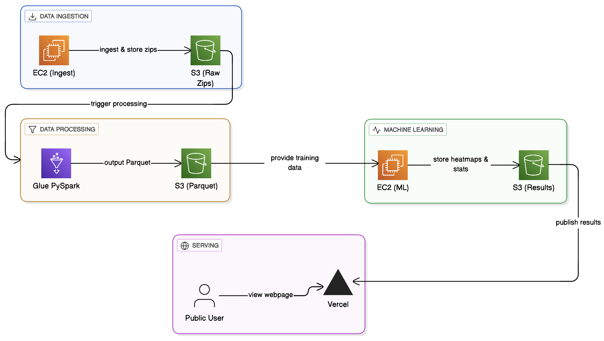

<!-- Hero -->

  
  <h1>🚦 Urban Crash Risk Radar - 5 Major US Cities      
    (AWS End-to-End Data Engineering Project)</h1>
  
<strong>Authors:</strong> Rohan Vibhuti, Ellen Martin & Alima Aqsai

  <!-- Badges -->
  

    
    
    
    
  

  

    <em>Memphis (TN) • Detroit (MI) • Dallas (TX) • Houston (TX) • Los Angeles (CA)</em>
  

  <h3>“A multi-city lakehouse that ingests crash & weather data, engineers features, trains a predictive model on ~8 years of historical data, and serves yearly risk heatmaps on the web — using AWS only.”</h3>

---

<!-- Animated divider -->

  

## 🧭 Problem → Why This Matters
Cities pay a steep price for road crashes — in lives, in health, and in billions of dollars. Agencies need **early signals** of **where** and **when** risk is rising so they can target enforcement, redesign streets, and deploy resources before the next collision.

> We transform raw civic data into **yearly, cell-level risk** that leaders can act on.

## 🎯 Goal 
Ingest historical crash data for five U.S. cities, enrich with weather & time features, **predict crash risk per grid cell for the next year**, and publish a **map-based heatmap** for cross-city comparison.

---

<!-- Subtle animated icons row -->

  
  
  
  
  

## ⚙️ Pipeline at a Glance

- **Ingest**: Historic crash data (50 years nationwide) → **Amazon S3** (`raw/`) via **AWS EC2** and **Python**, using multi-thread, parallel processing for speedy ingestion in memory.
- **Process**: Clean & process as parquet via **AWS Glue** → **Amazon S3** (`processed/`
- **Model**: Predict risk for latitude and longitude (XGBoost)  → JSONL/GeoJSON predictions stored in **Amazon S3** (`predictions/`)
- **Visualize**: Static site on **Vercel** (Leaflet.js) renders an **animated heatmap** per city, per user request, and displays model performance measures: https://urban-crash-risk-radar.vercel.app/

---

## 🗺️ Cities
**Memphis • Detroit • Dallas • Houston • Los Angeles**  

- Public Historical Crash Data: https://www.nhtsa.gov/file-downloads?p=nhtsa/downloads/FARS/
---

## ✨ What makes it stand out
- **Multi-city lakehouse** — partitioning by year and city
- **Spatiotemporal features** — history windows, neighbor context, weather signals, time-of-day, road conditions
- **Production-ish flow** — ingestion, partitioned Parquet, API endpoint, static site  
- **Academy-friendly** — only core AWS; graceful fallbacks where services are limited
- **Simple, user-friendly interface** - serving the necessities, without fluff or redundant features, enabling users to quickly retrieve relevant information
- **Opportunities for Expansion** - opportunity to scale up production and permit users to specify other cities and states, for which real-time ML predictions can be generated. Opportunity for annual model updates with new data availability.

---
## Pipeline Stages
For more detailed pipeline architecture and feature selection, please refer to our technical report. 

1. AWS S3 Bucket creation (/rawData, /processedData, /scripts)
2. Initiation of AWS EC2 instance (T4.small)
3. [Python Script for parallelized, multi-thread ingestion of 50 years of zip data, run in EC2 instance](download_fars_data.py). We used a parallel, multi-threaded script given the large number of data files downloaded, to ensure speedy ingestion. 
4. ETL and Schema Normalization in AWS Glue, storage in S3 /processedData, monitoring progress and logs using AWS CloudWatch
- extraction of accident.csv from rawData zips
- data quality and consistency across years (handing null data and missing information)
- formatting column names and selecting features for ML models
- converting to Parquet format, partitioned on Year to allow users to specify specific date ranges
5. [PySpark processing script with thorough debugging for unzipping data, standardizing schema, data cleaning, and parquet formatting](glue_processing.py)
6. XGBoost Machine Learning Model Training and Prediction, run in EC2 instance, storing model predictions in S3 Bucket.
7. [Machine Learning Model Python Script](train_models.py)
8. [Static webpage hosting using Vercel (HTML + tailwind.css)](index.html)

<!-- Footer animation -->

  

